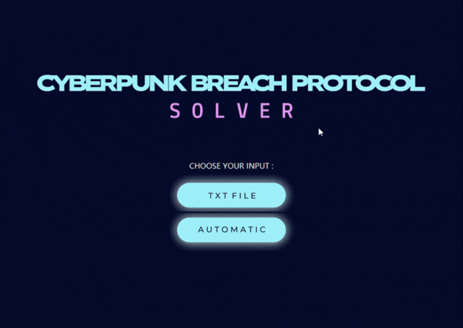
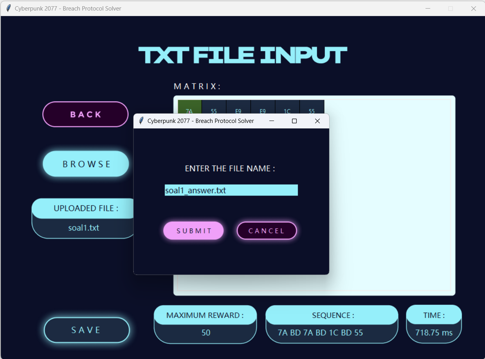

# Tugas Kecil I Strategi Algoritma (IF2211)
## Muhammad Naufal Aulia (13522074)


## Table of Contents
* [Tentang Program](#cyberpunk)
* [Screenshots](#screenshots)
* [Dependencies](#dependencies)
* [How to Use](#how-to-use)


## Cyberpunk 2077 Breach Protocol Solver (Desktop App) <a href="cyberpunk"></a>
> Cyberpunk 2077 Breach Protocol adalah minigame meretas pada permainan video Cyberpunk 2077. Minigame ini merupakan simulasi peretasan jaringan local dari ICE (Intrusion Countermeasures Electronics) pada permainan Cyberpunk 2077. Pemain harus mengetahui rute sekuens optimal dari kecocokan sekuens dengan token yang ada pada sebuah matriks untuk mendapatkan _reward_ maksimal.

Pada program ini, dilakukan pencarian solusi atas persoalan tersebut menggunakan pendekatan algoritma _brute force_   yang akan mencoba semua kemungkinan solusi yang ada, dan memilih solusi yang paling optimal. Solusi beserta urutan sekuensnya akan ditampilkan pada GUI yang ada di program ini.


## Screenshots <a href="screenshots"></a>




## Dependencies <a href="dependencies"></a>
- Python 3.x

## How to Use <a href="how-to-use"></a>
1. Clone repository ini dengan 
    ```
    git clone https://github.com/NopalAul/Tucil1_13522074
    ```
2. Buka file directory/location tempat repository berada, buka folder `bin`, buka folder `dist`, hingga ditemukan file `cyberpunk77.exe`
    ```
    \Tucil1_13522074\bin\dist\cyberpunk77.exe
    ```
3. Jalankan program dengan double click pada file `cyberpunk77.exe`, akan langsung terbuka tampilan awal GUI program
4. Pada program, pilih salah satu input dengan klik tombol `txt file` atau `automatic`
5. Jika memilih input `txt file`, klik tombol `browse` untuk mengupload file, lalu klik tombol `solve` untuk menghasilkan solusi
6. Jika memilih input `automatic`, lengkapi bagian kosong seperti contoh berikut:
    ```
    TOKEN AMOUNT: 5
    TOKEN: BD 1C 7A 55 E9
    BUFFER SIZE: 7
    MATRIX SIZE: 6 6
    SEQUENCE AMT: 3
    MAX SEQUENCE: 4
    ```
    lalu klik tombol `solve` untuk menghasilkan solusi
7. Jika ingin menyimpan hasil ke file txt, klik tombol `save` lalu pilih direktori penyimpan dan nama filenya
8. Close program untuk mengakhiri
